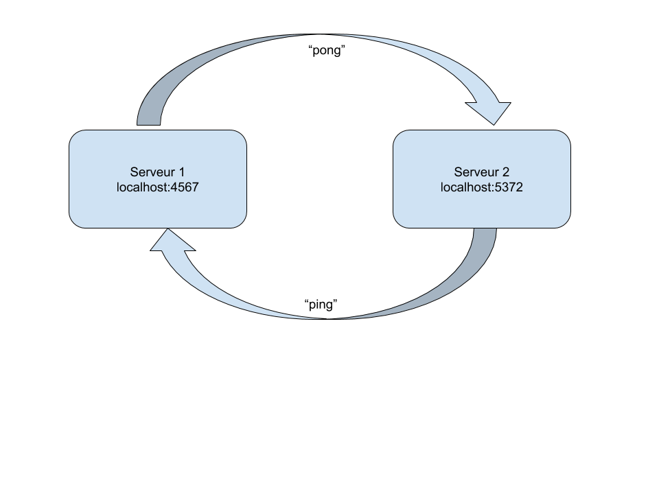
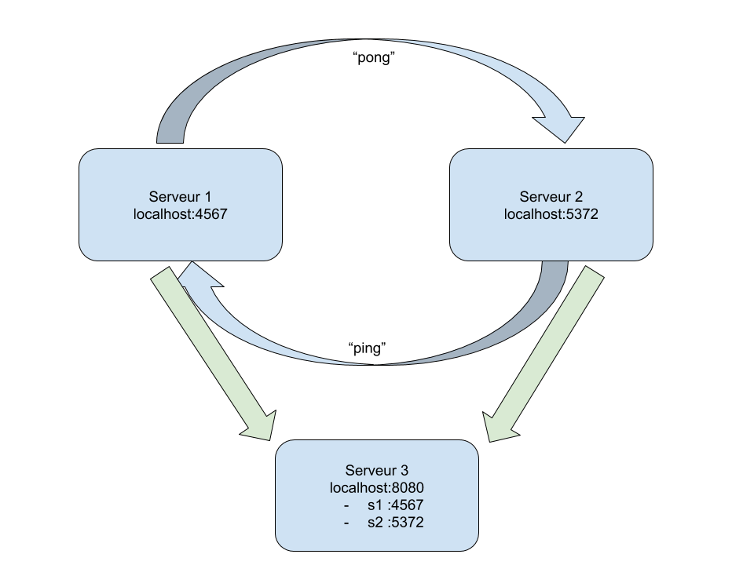
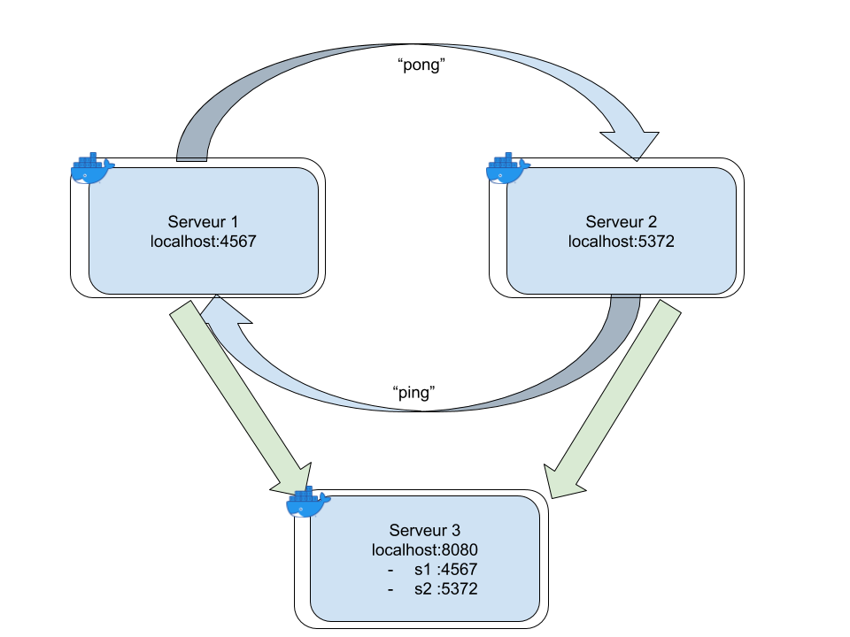
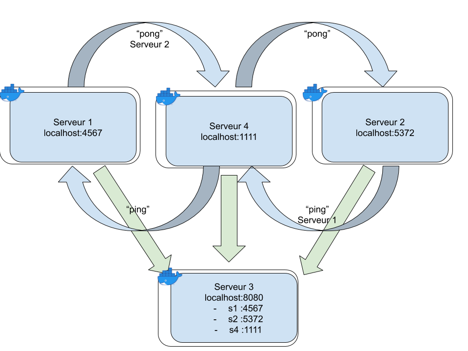

# Docker et architecture microservices

Tout le code que vous devez écrire dans ces exercices sera dans le langage de votre choix et ne sera pas lu lors de la correction.

Vous devez me rendre un repository git à la fin du cours. (Ecrivez des messages de commit clairs SVP)

## Exercice 1 : ping pong

Ecrire deux serveurs devant communiquer l'un avec l'autre.

- le premier doit envoyer une requête http "pong" vers le deuxième
- à ce moment le second a une demie seconde pour lui envoyer une requête "ping"
- à la récepetion de cette requête le premier a alors une demie seconde pour lui envoyer une requête "pong"

Les deux serveurs connaissent l'adresse l'un de l'autre à l'avance.

(N'oubliez pas de commit).

## Exercice 2 : Annuaire

Même problème que l'exercice 1 mais les serveurs ne connaissent pas l'adresse l'un de l'autre, seulement la leur.

1. On introduit donc un autre serveur qui connait l'adresse de tous les serveurs à l'avance. (on commit)
   (Les deux premier serveurs connaissent son adresse à l'avance)

2) Le 3ème serveur ne connait plus les adresses des serveurs : il attend qu'ils le lui disent, les deux premiers serveurs doivent lui donner leur adresse au démarrage.

## Exercice 3 : Docker

On a fait des microservices simple maintenant on veut dockeriser !

Créer un dockerfile pour chacun des serveurs et les lancer dans leur container respectif.

Le ping pong doit continuer à fonctionner.

## Exercice 4 : message broker

On ne veut plus que nos serveurs s'envoient "pong" et "ping" directement (il faut un rebond).

On va donc créer un 4ème serveur qui s'occupera de la communication : il reçoit un message avec un destinataire et il est chargé de lui transmettre.

Ce serveur vient avec son image docker bien entendu.

## Rendu

A la fin de la journée, merci de commit et pusher tout votre travail (même incomplet). Et de m'envoyer le lien du repository à arthur.escriou@gmail.com ou sur discord.
